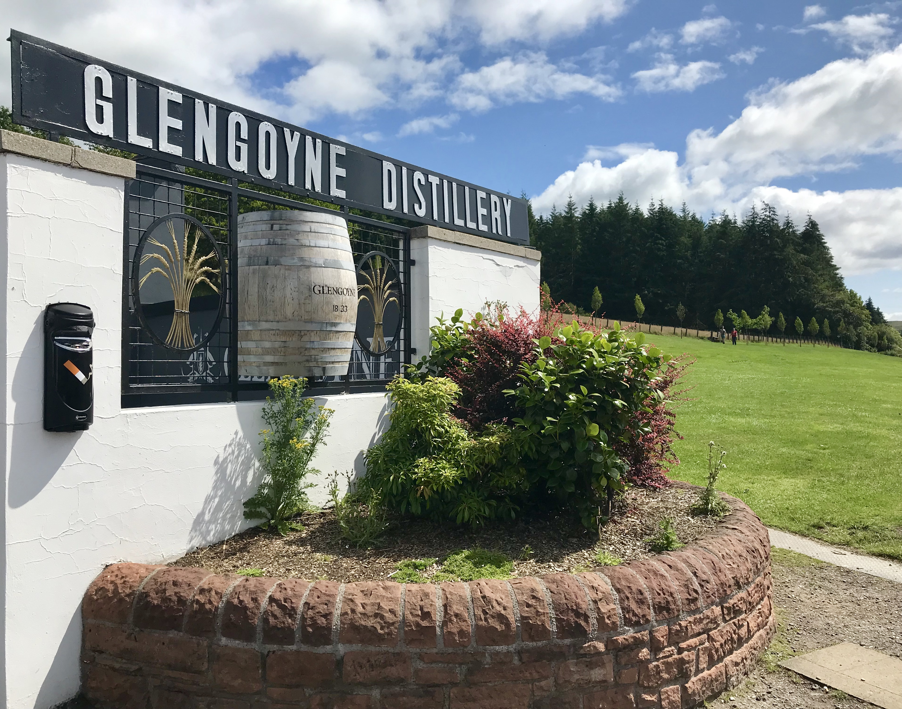

# TO-DO
* add github and page links

---

```{r setup, include=FALSE}
knitr::opts_chunk$set(echo = TRUE, warning = FALSE, message = FALSE, 
                      results = "show", cache = FALSE, autodep = FALSE)
knitr::opts_knit$set(root.dir = "external-data/whisky")
```

```{r}
here::i_am("analysis/scotch-analysis-part1.R")
source(here::here("analysis", "scotch-analysis-part1.R"))
```

## Part 1: Introduction & Building the Dataset
Nearly a decade ago, I had recently completed a cross-country move to California with lofty dreams of producing inspiring stories for film and television. I was new to Los Angeles, and everyone was a stranger – no less my new housemate met through Craigslist. I had barely finished unpacking my few belongings on the first night in my new home when he beckoned me to the kitchen table, where he sat with two glasses and three different bottles of whisk(e)y.

Until that moment, I had never tasted scotch before. I had always thought that characters who sipped scotch or bourbon in movies looked cool, and I had encountered cheaper varieties of the liquor hidden in mixed drinks during my college days, but I had never taken the time to truly *taste* it before. My housemate graciously led me through samples of each spirit, sharing little nuggets about flavor notes and the effects of ice, all while we had a few laughs and got to know each other. I enjoyed the experience immeasurably, and he could tell; he generously gifted me the remainder of two different bottles we had drank that evening. Suddenly, I had the beginnings of my very own collection of whisky.

Much has changed in my life since then. Instead of living in Los Angeles with kind internet strangers, I live in Philadelphia with my lovely wife and dog. Instead of grinding through a career in the entertainment industry, I work in higher education with aspirations of transitioning to a more data-focused role. One constant that has remained, however, is a deep love for whisk(e)y, particularly scotch whisky. Nothing beats sipping on a glass of sweet, spicy scotch neat. I even convinced my wife to spend part of our honeymoon in Scotland touring distilleries and trying some of my favorite whiskies straight from the source.

<br>
<div class="figure" style="text-align: center">

<p class="caption">
*Outside of Glengoyne Distillery on our first day in Scotland.*
</p>
</div>
<br>

Whisky is a fun casual hobby because there is much to learn and many spirits to try. That’s why I’ve begun this project to explore and better understand scotch whisky. Not only can it be overwhelming to choose a good bottle of whisky; it can also be very expensive to guess wrong! So why not make those guesses marginally more educated? By leveraging data, what little I already know about whisky, and new tips and fun facts I plan to discover along the way, I hope to arrive at a worthy prize for my efforts: my next bottle of scotch.

## Project Goals
The overarching goals of this mutli-part project are threefold:

  - To augment my learning about whisky brands, regions, flavors, and options
  - To understand the breadth, depth, and quirks of the scotch whisky industry
  - To leverage data to determine which whiskies I ought to try myself

## Building the Dataset
The conclusions of this project are only as useful as the collected data that underlies it. [Part 1](GITHUB%20LINK) details the process by which data were scraped, joined, reshaped, and cleaned from multiple websites for further analysis.

### Guiding Questions
  - From where can we scrape data on whisky reviews, ratings, and prices?
  - From where can we find information on distilleries, brands, and regional locations?

### Step 1: Finding the Data
*From where can I scrape data on whisky reviews, ratings, and prices?*

During the COVID-19 pandemic, I read a book entitled [Tasting Whisky](https://www.amazon.com/Tasting-Whiskey-Insiders-Pleasures-Spirits/dp/1612123015) by Lew Bryson, who happens to reside in the greater Philly area and therefore littered his book with easter eggs referencing the city I’ve grown to love. Bryson was a managing editor for the respected magazine [Whisky Advocate](https://www.whiskyadvocate.com/ratings-and-reviews/) for nearly 20 years, so I had a peek at Whisky Advocate’s website for some inspiration on where I might find scotch whisky data online. Turns out that Whisky Advocate publicizes all of its magazine contributor reviews online, which includes nearly 10,000 whisk(e)y releases of all varieties from across the world and well over 2,000 scotch whisky reviews alone. Bingo!

### Step 2: Whisky Ratings & Reviews
We can use [`rvest`](https://rvest.tidyverse.org/) to [scrape data from Whisky Advocate](GITHUB%20URL) for all scotch reviews, including variables such price, rating points, review description, and more. This was a good chance to sharpen my regex skills; whisky names on Whisky Advocate include not only the distillery name and specific release name, but also two key variables of interest: `age` and `ABV`. It was useful to bounce between the [`stringi`](https://github.com/gagolews/stringi) and [`stringr`](https://stringr.tidyverse.org/index.html) packages to extract `age` and `ABV` (where available) from each messy whisky name, as well as to clean up a few other variables.

### Step 3: Distillery Names, Regions, & Locations
*From where can I find information on distilleries, brands, and regional locations?*

While scraping from Whisky Advocate, I realized that another valuable variable was hiding in plain sight within the whisky names: the distillery or brand name. However, distillery names are much less consistently presented than whisky ages or ABVs, which made extracting them far more difficult. I decided to scrape distillery names from another source, but most whisky distillery lists online only paid attention to single malt scotch brands and entirely ignored major blended brands such as Johnnie Walker or Dewar’s, which was a non-starter. Although most of the whiskies in Whisky Advocate’s scotch category are single malt, sources indicate that [blended scotches comprise a whopping 90% of all scotch sales worldwide](https://www.thescotchadvocate.com/blended-scotch.html), so it felt incomplete to ignore those brands entirely.

Like nearly everything these days, the answer was on Wikipedia. To collect the most expansive list of distillery names, I [scraped data from three separate Wikipedia pages](GITHUB%20URL) ([1](https://en.wikipedia.org/wiki/List_of_whisky_distilleries_in_Scotland),
[2](https://en.wikipedia.org/wiki/Category:Distilleries_in_Scotland),
[3](https://en.wikipedia.org/wiki/Category:Blended_Scotch_whisky)) and combined them. I was also keen on collecting data from link #1 on the regional location for each distillery. While Scotland is quite small geographically and is roughly the size of South Carolina, regional
differences often translate into very unique flavor notes and aromas expressed in whisky, so I knew `region` would likely become an important variable to explore.

While considering regional differences, I also realized I might like to plot distilleries on a map of Scotland later in the project to better understand the spread and clustering of distilleries across the country. I found what I needed and more on [whisky.com](https://www.whisky.com/whisky-database/database.html), where most distilleries have their own sub-page with tons of information. I focused on scraping distillery latitude and longitude coordinates, as well as regional names again to supplement whatever had been grabbed from Wikipedia. After cleaning the data, I had a solid list of distillery and brand names, including regional and coordinate locations for the majority of them.

### Step 4: Putting It Together
To [join the ratings and distilleries data together](GITHUB%20URL), we can implement a lovely package called [`fuzzyjoin`](https://github.com/dgrtwo/fuzzyjoin), which includes variations on join operations in [`dplyr`](https://dplyr.tidyverse.org/index.html) that allow for inexact
matching on values such as regular expressions (regex), Euclidean or Manhattan distance, and much more. `fuzzyjoin` was perfect here because it enabled distillery matches whenever the distillery name appeared *somewhere* within the longer whisky name, which was fairly irregular
across whisky releases.

A quirk during joining was that roughly 100 scotch releases included two different distillery names, either through a special collaboration between distilleries or because an independent bottler referenced the distillery from where their re-branded whisky originated. An example of
the latter would be **Gordon & MacPhail (distilled at Strathisla) 40 year old**, where **Gordon & MacPhail** is the independent bottler (one of the largest in Scotland) and **Strathisla** is the original single malt distiller.

Whisky releases with two named distilleries created ~100 duplicate rows, which could bias conclusions reached about the data if included. Ultimately, I decided to create two versions of the full dataset: one that includes all duplicates for brand-level analyses, and a second without duplicates for all other analyses.

**{var_table}**

Here’s a glimpse of the data:

**{glimpse_full}**

[Code](GITHUB%20LINK) and [data](GITHUB%20LINK) for Part 1 available on
Github.

## Next Steps
Now that we have our data, it’s time to dig in! Next, [Part 2](PAGE/GITHUB%20LINK) covers exploratory data analysis to better understand distributions of and relationships between variables including `distillery`, `type`, `age`, `ABV`, `price`, and `points`.

<br>
<div class="figure" style="text-align: center">

<p class="caption">
*Special honeymoon dram presented to us at Glenfiddich Distillery.*
</p>
</div>