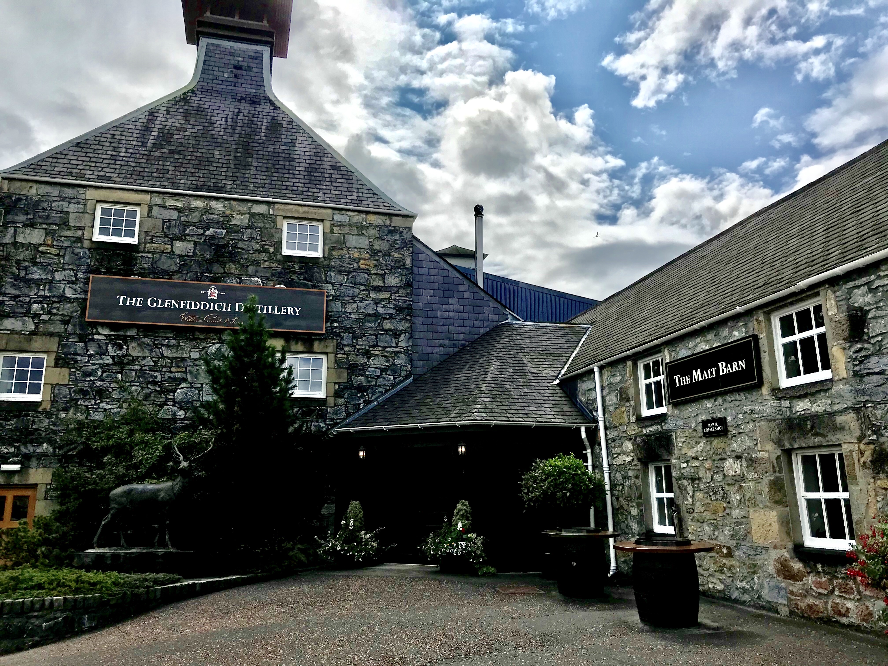
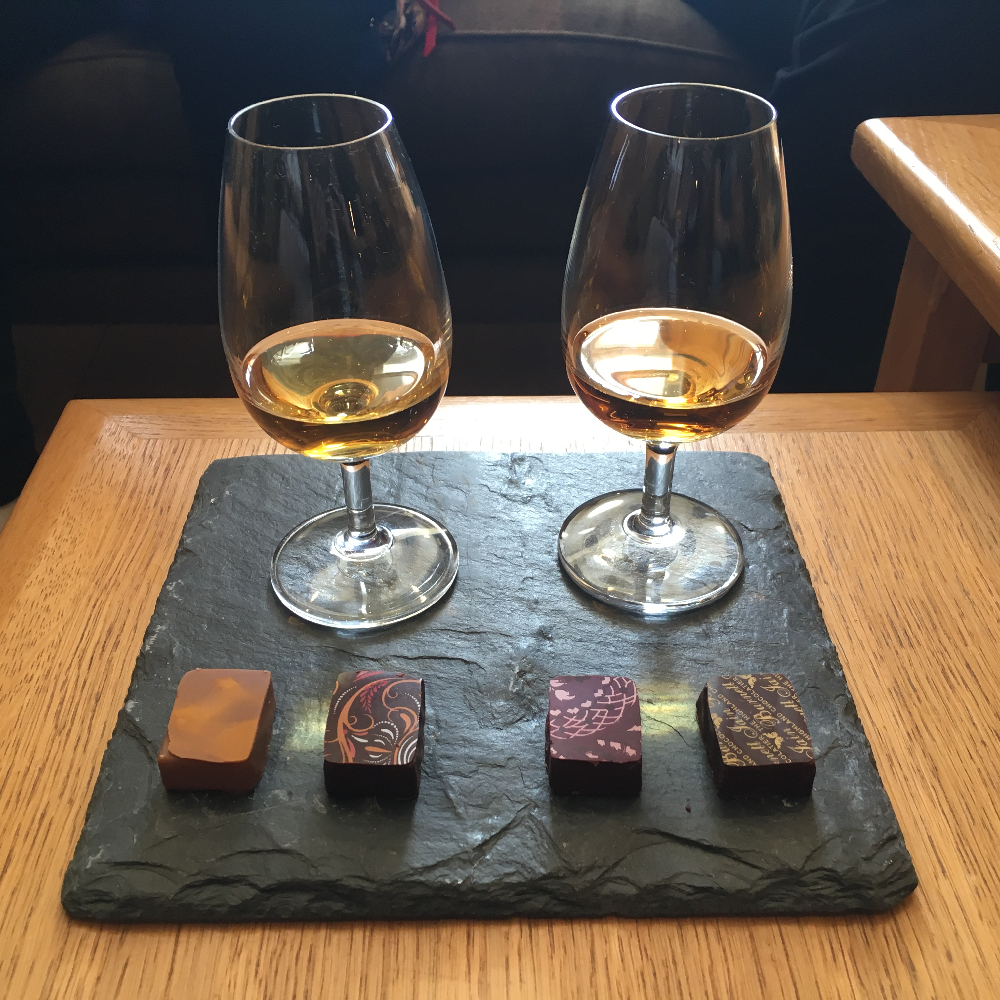

# TO-DO
* add github and page links

---

```{r setup, include=FALSE}
#knitr::opts_chunk$set(echo = TRUE, warning = FALSE, message = FALSE, 
#                      results = "show", cache = FALSE, autodep = FALSE)
#knitr::opts_knit$set(root.dir = "external-data/whisky")
```

```{r, include=FALSE}
#here::i_am("analysis/scotch-analysis-part2.R")
#source(here::here("analysis", "scotch-analysis-part2.R"))
```

## Part 2: Exploratory Data Analysis
Welcome to the next installment of **Exploring Whisky: The Journey to My Next Bottle of Scotch**, a multi-part project in which I leverage data to share fun facts about whisky as I continue my hopeful search to discover delicious scotch. 

Previously in [Part 1](https://www.google.com/), we built our dataset by scraping scotch whisky reviews, prices, brands, regional locations, and more from [Whisky Advocate](https://www.whiskyadvocate.com/ratings-and-reviews/), Wikipedia ([1](https://en.wikipedia.org/wiki/List_of_whisky_distilleries_in_Scotland), [2](https://en.wikipedia.org/wiki/Category:Distilleries_in_Scotland), [3](https://en.wikipedia.org/wiki/Category:Blended_Scotch_whisky)), and [whisky.com](https://www.whisky.com/whisky-database/database.html). 

With our data ready to go, it's time to dig in! [Part 2](https://github.com/bengreenwald/whisky/blob/main/analysis/scotch-analysis-part2.R) covers exploratory data analysis to better understand distributions of and relationships between several variables, starting with a few gathered from Whisky Advocate.

## Project Goals
As a reminder, the overarching goals of this mutli-part project are threefold:

* To augment my learning about whisky brands, regions, flavors, and options
* To understand the breadth, depth, and quirks of the scotch whisky industry
* To leverage data to determine which whiskies I ought to try myself

## Exploratory Data Analysis
With our data scraped, reshaped, cleaned, and saved, we can begin to explore these data to better understand univariate distributions and whether certain variables may be related. In Part I, we'll focus on `type`, `age`, `ABV`, `price`, and `points`.

**{glimpse_data}**

### Guiding Questions
* Which type of scotch whisky is most commonly reviewed by Whisky Advocate?
* Are single malt whiskies more expensive and/or highly-rated than blended varieties?
* Are older whiskies more expensive and/or highly-rated than younger whiskies?
* Do whiskies with stronger alcohol concentrations command higher prices and/or better ratings? 
* Are more expensive whiskies rated more highly? Is splashing the cash worth it?

### Benchmark Scotch Whiskies
If an ultimate goal is to determine which bottle(s) of scotch to buy next, it's worthwhile to establish a benchmark of what I already know I like. To keep things simple, let's select two whiskies with slightly different profiles to serve as benchmarks.

**Glenfiddich 12 year old**: When my [generous housemate in Los Angeles from Part 1](https://www.google.com/) gifted me two bottles of whisk(e)y, one was Woodford Reserve bourbon, and the other was Glenfiddich 12, so this whisky holds a special place in my heart. Glenfiddich 12 also happens to be deliciously fruity, sherried, and smooth. Plus, it's reasonably affordable for scotch and widely available in U.S. liquor stores, resulting in a solid, reliable, and popular whisky with entry-level appeal. While in Scotland and touring the Speyside region, my wife and I visited Glenfiddich and sampled at least 10 drams of different scotch whiskies (we got tipsy and lost count). Glenfiddich 12 was the very first scotch I ever tried, and while I've since enjoyed dozens of other varieties, it remains a memorable favorite for me.

<br>
<div class="figure" style="text-align: center">

<p class="caption">
*Outside of Glenfiddich Distillery in the Speyside region.*
</p>
</div>
<br>

**Glengoyne 21 year old**: A few years before our honeymoon pilgrimage to Scotland, my wife's family toured Scotland and returned home raving about a special experience at Glengoyne, a respected distillery nestled in the gorgeous countryside directly upon the [Highland Line](https://en.wikipedia.org/wiki/Highland_Boundary_Fault) that separates the Highland and Lowland regions in Scotland. Naturally, Glengoyne became our first stop on our first day in Scotland, and it didn't disappoint. After an incredible tour of the historic distillery, we settled in for a dual tasting of Glengoyne scotch paired with artisanal chocolates. I'll never forget the smooth, spicy vanilla notes of Glengoyne 21 alongside the velvety chocolate treats. Compared to Glenfiddich 12, Glengoyne 21 is harder to find in the U.S. and pricier as well, but it's certainly worth the extra coin for something special.

<br>
<div class="figure" style="text-align: center">

<p class="caption">
*Delicious tasting of Glengoyne 18 and 21 with artisanal chocolates.*
</p>
</div>
<br>

**{benchmark_table}**

We'll periodically reference these two whiskies throughout the extended project.

### Scotch Type
**Which type of scotch whisky is most commonly reviewed by Whisky Advocate?**

Definitions of scotch whisky `type` are fairly nuanced. When most people think of scotch (myself included), they probably imagine **single malt scotch**, a type of whisky that requires a litany of very specific restrictions. Single malt scotch *must* be: 

* Distilled at a single distillery in Scotland using a pot still distillation process
* Made from a mash of malted barley
* Matured in oak casks in Scotland for at least 3 years and 1 day (commonly, much longer)

Today, single malt scotch is often considered by purists to be the "premier" scotch whisky type; single malts convey nuance, authenticity, and elegance as they boldly stand alone (neat) or with a few drops of water in a [Glencairn whisky glass](https://www.glencairnwhiskyglass.com/). But despite the reverence towards single malts, blended whisky far outpaces single malt in global sales, [accounting for roughly 90% of all scotch sold worldwide](https://www.thescotchadvocate.com/blended-scotch.html). Blended whisky is often cheaper and can be deployed in cocktails, and it takes great skill, knowledge, and experience to design a perfect blend of different whiskies. Our data include two types of blended whisky: 

* **Blended Scotch**: The most common blended variety, which mixes malt whiskies with grain whiskies (whisky made from a non-barley mash) from several different distilleries (*Johnnie Walker, Dewar's*)
* **Blended Malt Scotch**: A rarer variety that requires a blend of single malt scotches from at least two distilleries (*Compass Box*)

Admittedly, I stick to single malt scotch 99% of the time. I simply enjoy the taste of blended scotch less and also don't love how most blended brands fail to divulge details about from where their component whiskies are actually sourced. *However*, I commit to keeping an open mind throughout this project in the interest of discovering new whiskies that I could grow to love -- even if they are blended.

**{type_pictogram}**

In the above pictogram (generated using the [`waffle`](https://github.com/hrbrmstr/waffle) package), each tumbler glass represents 10 whisky releases in our scotch data. Whisky Advocate are overwhelmingly reviews single malt scotch releases (over 80%), despite the common estimate we previously reported that blended scotch accounts for 90% of sales worldwide. 

Blended scotch, then, appears to be disproportionately featured by Whisky Advocate. Perhaps Whisky Advocate deliberately favors single malts to appeal to their readers, or like other "whisky snobs," they have their own strong preference for single malts. Or perhaps there are simply fewer types of blended scotch out there that dominate sales attention, compared to a deluge of nuanced single malt varieties that each maintain their own niche markets. 

Later, we'll take a closer look at `ABV`, `price`, and `points` grouped by whisky `type` to discern if any trends emerge, but first, a quick peek at whisky `age`.

### Age
A whisky's listed `age` is a guarantee of the youngest whisky used in the bottling. As mentioned, scotch whisky must be aged in casks for at least 3 years, but there are several more common ages found in scotch whisky releases, as evidenced by the interactive plot below.

**{age_html}**

12 year old scotch, and to a lesser extent whiskies aged 10, 15, 18, and 21 years, are very common across the industry. The apparent reasons why these ages occur most often? Marketing and tradition. It's been suggested that, when single malt scotch started to become more popular in the past half century, major producers and distillers poised to enter the market established a baseline of 12, 15, and 18 year whiskies dictated by their abundant supply at the time. 

Since then, ages in these increments have become increasingly customary across the industry, perhaps because they are the optimal age for whiskies, but more likely because consumers over the years have come to associate "quality scotch" with scotch aged at least 12 years and they sell better, depending on the market. Many consumers also lust after extremely old whiskies because they believe that "old" = "rare" = "expensive" = "exquisite" Special releases and collector's items account for the bumps at 25 and 30 years, followed by 35, 40, and 50 years. 

But aging whisky is trickier than "older is better." A very young whisky, while perhaps less smooth and less attractive to consumers optically, can still be very tasty and is much quicker to produce for distilleries with supply/demand issues. On the flip side, each year in the barrel for a very old whisky means less product (whisky can evaporate at a rate of 1% per year!), plus more "barrel taste" that further dilutes the flavor of the whisky. Distillers must find their own preferred balance of taste and marketability, which sits right around 12 years for most.

### ABV
Aging also has implications on a whisky's alcohol by volume, or `ABV`. Not only does whisky evaporate over time in the barrel, but its alcohol content decreases as well. So distillers work backwards when they initially fill their casks; whisky often starts between 60-75% ABV after distillation, but aging, diluting, and blending bring the ABV down closer to the legal minimum of 40%. 

**{ABV_ridge}**

As shown in the [ridgeline plot](https://wilkelab.org/ggridges/) above, 40% represents not just the lower bound, but often the magic number, particularly for blended scotch. One explanation is that distillers may need to pay higher alcohol taxes on ABVs above 40% depending on the country, so striving for 40% ABV may save money. For whisky products released at cask strength (straight out of the barrel without any dilution), much higher ABVs at 55-60% or above are expected. 

Why the bump at approximately 46% ABV across all three types, particularly single malt and blended malt? Look no further than chill filtration, the process of carefully cooling scotch down to roughly 0°C (32°F) and passing it through a filter before bottling. Fine single malt scotch (or blends created from them) naturally contain impurities and sediments left over from the distillation process and can become hazy in the bottle or when being served with ice or water. Chill filtration is a cosmetic solution that eliminates these imperfections. Both of my two benchmark whiskies, Glenfiddich 12 (40% ABV) and Glengoyne 21 (43% ABV), are among a healthy majority of scotch whiskies that are chill-filtered.

Chill filtration is not without its haters, though! Many distillers and purist drinkers actively celebrate the authenticity and taste of whisky that hasn't been chill-filtered, and this sensibility towards a more "natural product" has only gotten more popular in the last couple of decades. But without chill filtration, distillers must counteract a whisky's propensity for haze in the presence of cooler temperatures by increasing its alcohol content to 46% ABV. Science! 

### Price
**Are single malt whiskies more expensive than blended varieties?**

`price` is a critical variable in these data. As a relatively modest whisky consumer, I rarely pay over $100 on a bottle of scotch, but I find it remarkable how much collectors and connoisseurs are willing to pay to obtain the rarest whiskies on earth. In some cases, people will shell out tens or even hundreds of thousands of dollars for a single bottle!

**{price_ridge}**

Unfortunately, this intense demand for the rarest of rare whiskies significantly drives up ultra-premium prices, and the resulting data demonstrates extreme positive skew, making the above ridgeline plot impossible to read. Let's apply a log transformation to `price` to make this plot more legible and to help us understand the distribution of scotch prices.

**{price_log_ridge}**

From here, we see that there are plenty of whiskies under $100, which is great for my wallet! I certainly expected to see the long tail for single malt scotch, with some premium varieties costing well over \$10,000. 

In contrast, all but two blended malt options can be found for less than ~\$600, though prices for Johnnie Walker Odyssey (\$1,100) and The Famous Grouse 40 year old (\$3,378) are tame all things considered. Blended scotch covers the entire spectrum; while there appears to be several blended releases that are wildly expensive, the vast majority can be purchased for under \$1,000. Using \$1,000 as a somewhat arbitrary threshold for "very expensive," it appears that a higher proportion of single malt scotch in these data are pricey compared to blended varieties. 

**{pct_expensive_table}**

I'm most intrigued by the variation in prices of blended scotch whisky. Given the wide spread of these data, there is a glut of blended scotch between \$1,000-\$10,000, plus at least one whisky well over \$100,000. I'm curious as to which blended brands are bucking my preconception that "blended = cheaper" and instead driving ultra-premium scotch sales for certain releases. 

**{expensive_blend_table}**

All thirteen blended scotches pricing above \$1,000 earned at least 91 rating points from Whisky Advocate reviewers -- for that kind of money, they better be good! Six of the thirteen, including five of the top six most expensive varieties, belong to [The Last Drop](https://www.lastdropdistillers.com/). I hadn't previously heard of The Last Drop, but it appears that they specialize in unearthing highly rare and extraordinary spirits from around the globe and selling from a very low stock at ultra-premium prices...and likely out of my budget. 

Not to be outdone, a more household brand (Johnnie Walker) appears four times within this upper echelon of blended scotch, including the Diamond Jubilee by John Walker & Sons priced at a *staggering* \$157,000. It blows every other price in these data out of the water, and it's difficult to imagine just who exactly would spend that sort of money just for a bottle of whisky. For that price, I could purchase **`r round(diamond_jubilee_price/glenfiddich_12_price)` bottles of Glenfiddich 12** or **`r round(diamond_jubilee_price/glengoyne_21_price)` bottles of Glengoyne 21**, more than enough for a lifetime. 

Of course, drinking the same exact whisky for the rest of my life contradicts the purpose of this project: to discover my *next* bottle of scotch, not the same stuff I already love. As this journey continues, it will eventually become crucial to narrow down the scope of whiskies based on a realistic budget. No sense in becoming love-struck with a particular whisky, only to find out it would clear out my bank account. We'll come back to this further down the line. 

### Points
**Are single malt whiskies more highly-rated than blended varieties?**

My hyper-generalized expectations about scotch before beginning this project were that single malts taste better, costs more, and are rated higher than blended whisky. Until proven otherwise, I still prefer the taste of single malt, and we've so far learned that single malts tend to be more expensive than blends, with the huge exception of Johnnie Walker's Diamond Jubilee. But what do the reviewers of Whisky Advocate think? Do their much more experienced and nuanced palettes hold single malts in higher regard as well?

([A reminder of Whisky Advocate's rating scale](https://www.whiskyadvocate.com/ratings-and-reviews/).)

**{points_ridge}**

Judging from the ridgeline plot, there isn't much variation between the distributions of rating `points` across the different whisky types. Most whiskies across all three types score between 80-89 points, indicating "Good" or "Very Good" scotch. If anything, single malt's distribution appears ever so slightly shifted to the left, which suggests slightly lower ratings. Ratings for Glenfiddich 12 (86 points) and Glengoyne 21 (87 points) seem fairly average for single malts, so hopefully there is an opportunity for my next scotch to taste even better than my two benchmark whiskies without going terribly overboard on price.

Take notice of how both blended distributions cut off sharply around 76-77 rating points, but the single malt tail extends way below that mark. Whiskies that score between 75-79 points are "Mediocre" (drinkable with minor flaws), whereas those below 74 points are flat out "Not Recommended." Harsh! I'm curious about which single malts fit that description. 

**{low_points_table}**

It turns out **Distillery Select 'Inchmoan' (distilled at Loch Lomond)** negatively skews the single malt data with a very low rating of 63 (the only scotch in the entire database under 70 points). Recall that the lowest possible score is 50 points, so 63 is quite poor. Reviewers describe the whisky's mid-palate as "harsh and unpleasant, with petroleum and vegetal notes." Sounds truly awful! 

The other nine on this "coveted" list include some interesting appearances, such as another two poorly-rated whiskies labeled as "Distillery Select" that were also distilled at Loch Lomond and one mature whisky from Highland Park (typically known as a reputable brand). Further, the name of **Tomintoul "With a Peaty Tang"** doesn't exactly inspire hope for a quality spirit, and reviewers confirm that.

The most fascinating entry here is **The Macallan 55 year old Lalique Decanter**. Macallan is an enormously prestigious brand, and the fact that such a special, old scotch scores this low is intriguing. The reviewer writes, "...the age gets the best of this whisky. The flavors flatten out and the wood dominates through the finish as the leather notes linger." Perhaps Macallan 55 Lalique serves as a good example that *older doesn't always mean better* -- too much time in the barrel may have ultimately thwarted the best parts of this whisky.

### Correlations & Relationships
**Are older whiskies more expensive and/or highly-rated than younger whiskies?**
**Do whiskies with stronger alcohol concentrations command higher prices and/or better ratings?** 
**Are more expensive whiskies rated more highly? Is splashing the cash worth it?**

So far, we've explored how distributions of whisky `age`, `ABV`, `price`, and rating `points` differ across scotch types. Could there be any meaningful relationships between combination(s) of those four variables?

We can check the correlation coefficients between them, but recalling the plots we've examined thusfar, it appears that none of the data that underlie these variables are normally distributed. In fairness, we've grouped these distributions by scotch `type`, so let's confirm that the ungrouped data is still not normally distributed with some Q-Q plots.

**{qq_grid}**

We find tons of irregularities contained within these Q-Q plots. Based on deviations from each respective qqline, `age` looks fairly positively skewed, `ABV` unsurprisingly includes a massive stack of whiskies at 40% ABV, and `points` appears slightly negatively skewed. Of course, as we know, `price` is a complete mess, thanks to Diamond Jubilee and many other luxury releases.

When these data represent extremely skewed or multimodal distributions, the Pearson correlation coefficient is no longer appropriate. Instead, we can use [Spearman's rank-order correlation coefficient](https://statistics.laerd.com/statistical-guides/spearmans-rank-order-correlation-statistical-guide.php) to more accurately work with non-linear data. Whereas a Pearson correlation is concerned with the **linear relationship** between two variables, Spearman's correlation determines the strength and direction of their **monotonic relationship** -- that is, how the variables tend to change together even if that change occurs at a non-constant rate. Using Spearman, each variable's values are ranked before then performing the correlation on the ranked data. We can plot correlations using the [`GGally`](https://ggobi.github.io/ggally/) package.

**{corr_plot}**

We find the strongest relationship (**0.81**) between `age` and `price`, which is somewhat expected. Older whiskies are rarer and in less supply than younger whiskies, and there will always be at least a few customers desperate for lavishly expensive scotch. Once again when plotting `price`, it is helpful to use a log transformation to more clearly observe any relationship hidden by skew. Because Spearman's correlation is concerned with ranked values, taking the log of `price` changes nothing about the monotonic relationship here.

**{age_price_hex}**

Remember that, while the relationship between `age` and `price` may appear linear, it is not because `price` is log-transformed. From the plot, we can observe the highest density of whisky releases between 10-21 years of age, which corresponds to our earlier finding about common whisky ages. Most of these whiskies likely fall in a distillery's **core range**, or their most popular releases, and their price point around \$100 or under reflects mainstream appeal. In contrast, we see that most whiskies older than 40 years cost at least \$1,000, if not much more. 
But is that older, more expensive scotch worth its weight in liquid gold? *Maybe sometimes, but not convincingly*. There is a mild positive correlations between `age` and `points` (**0.35**), but there are plenty of relatively young scotches that go dram for dram with rarer 30, 40, and 50 year old bottles, even at the upper extremes of the rating scale.

**{age_points_hex}**

How about the extremely mature whisky that scored nearly 20 `points` below its peers? It's Macallan 55 Lalique, which you might recall includes flattened flavors, notes of leather, and an unpleasant dominant wood barrel taste. It's possible that Whisky Advocate has been particularly harsh on this scotch, but given the publication's willingness to give at least passable ratings to most whiskies it reviews, I suspect claims about 55 Lalique's issues are warranted. 

There's also a weak positive correlation between `price` and `points` (**0.37**). Macallan 55 Lalique is the star of the show again; it turns out that one of the worst-rated scotch whiskies across all of Whisky Advocate reportedly costs more than \$10,000 a bottle! What an unfortunate blunder by Macallan. A lesson that even the most legendary distilleries can make mistakes. 

**{price_points_hex}**

On the bright side, it's encouraging to see the high density of observations around \$100 or just under and between 83-90 rating points. Recalling one of my benchmark scotches Glengoyne 21 (price: $80, points: 87), this range appears to be a sweet spot for affordability and quality with an abundance of options. While there are likely certain whiskies well over \$100 that are deserving of the extra money, there may be diminishing returns beyond a certain price threshold. To answer one of our guiding questions, splashing *some* cash for better scotch seems recommended, but only to a reasonable extent. I can stomach \$100 for a promising bottle. 

Lastly, there is a weak positive correlations between `ABV` and `price` (**0.35**). This relationship could be related to 1) higher prices for higher ABVs to offset additional taxes, and/or 2) higher prices for cask-strength whiskies that are seen as more premium products. The plot below doesn't reveal much of great value, except the expected high density of releases across multiple price points at 40% ABV (the legal minimum), 43% ABV (considered by many distillers to be a natural sweet spot), and 46% ABV (to avoid chill filtration). In general, `price` and `points` seem largely unaffected by `ABV`, so no need to get hung up on alcohol content as a major deciding factor in our search. Besides, I'd rather prioritize pleasant flavors and aromas over strong alcohol content.

**{ABV_price_hex}**

## Conclusions
Some of the major takeaways from this analysis:

* **Whisky Advocate overwhelmingly reviews single malt scotch whiskies**, with fewer than 20% of reviewed releases identifying as blended scotch or blended malt scotch. 

* **Scotch whisky is most commonly released at 10, 12, 15, 18, and 21 years old**, though while 12 years in particular may be a sweet spot for taste and maturity, this industry trend also appears heavily driven by marketing and tradition.

* **Blended scotch is most often diluted to 40% ABV (the legal minimum)**, while the ABV of malted scotch settles more frequently around 46% ABV -- the perfect alcohol content by volume suited for whiskies without chill filtration. Further, **ABV has little to no meaningful relationship with price or quality of scotch.**

* **Single malt scotch is generally more expensive than blended scotch**, though a handful of premium blended brands sell whiskies well over \$1,000. Johnnie Walker's blend Diamond Jubilee clocks in as the priciest scotch in these data at \$157,000 per bottle.

* Not only are **single malt whiskies generally rated similarly to blended varieties**, but all 10 of the whiskies deemed *Not Recommended* by Whisky Advocate are single malt scotches.

* **Scotch age has a strong, positive, non-linear relationship with price**, but *older* doesn't necessarily mean *better*, as age's relationship with rating points is much weaker. Fortunately for my wallet, these data contain **hundreds of highly-rated scotch whiskies at or below \$100 per bottle**, so there's little need to break to bank to enjoy good scotch.

[Code for Part 2](https://github.com/bengreenwald/whisky/blob/main/analysis/scotch-analysis-part2.R) available on Github.

## Next Steps
We've compared variables such as `age`, `ABV`, `price`, and `points` and learned about whisky `type` from scotch sourced all across Scotland. Next, [Part 3](https://www.google.com/) focuses on the regionality of scotch to better understand the distribution and clustering of distilleries across different regions of Scotland -- and what makes each region's whisky special and unique.