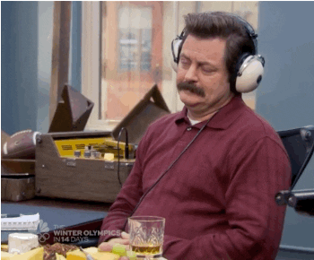

# TO-DO
* Add brief intro text for Part 3 above the glimpse. 
* Add additional guiding questions. 
* Complete/edit Distillery section.
* Complete/edit Region section.
* Send data to Tableau, create Tableau interactive map.
* Write Tableau section
* Write Conclusions.
* Write Next Steps.
* add images, adjust sizing/orientation
* add notated code throughout
* proofread (grammar, links)

---

```{r setup, include=FALSE}
knitr::opts_chunk$set(echo = TRUE)

if(!require("pacman")) {install.packages("pacman")}
pacman::p_load(here, # project workflow
               tidyverse, # reshaping + plotting the data
               ggtext, # custom ggplot formatting
               plotly) # interactive plots
```

```{r, include=FALSE}
scotch <- read_rds(here("data", "scotch-ratings-distilleries.rdata")) # load data without duplicates
scotch_with_collabs <- read_rds(here("data", "scotch-ratings-distilleries-with-collabs.rdata")) # load data with collaborations
source(here("code", "color-palettes.R")) # custom color palettes for analyses
source(here("code", "plot-theme-bg.R")) # custom ggplot theme
```

## Part 3: Mapping Distilleries & Regions
Welcome to the next installment of **Exploring Whisky: The Journey to My Next Bottle of Scotch**, a multi-part project in which I leverage data to share fun facts about whisky as I continue my hopeful search to discover delicious scotch. 

Previously in [Part 1](PAGE/GITHUB LINK), we built our dataset from scratch by scraping scotch whisky reviews, prices, brands, regional locations, and more from [Whisky Advocate](https://www.whiskyadvocate.com/ratings-and-reviews/), Wikipedia ([1](https://en.wikipedia.org/wiki/List_of_whisky_distilleries_in_Scotland), [2](https://en.wikipedia.org/wiki/Category:Distilleries_in_Scotland), [3](https://en.wikipedia.org/wiki/Category:Blended_Scotch_whisky)), and [whisky.com](https://www.whisky.com/whisky-database/database.html). Then in [Part 2](PAGE/GITHUB LINK), we explored the distributions of and relationships between variables including whisky `type`, `age`, `ABV`, `price`, and rating `points`.

Next, [Part 3](PAGE/GITHUB LINK)...short description about brands, regions, mapping. 

## Project Goals
As a reminder, the overarching goals of this mutli-part project are threefold:

* To augment my learning about whisky brands, regions, flavors, and options
* To understand the breadth, depth, and quirks of the scotch whisky industry
* To leverage data to determine which whiskies I ought to try myself

## Mapping Distilleries & Regions
INTRO TEXT FOR PART 3

```{r, echo=FALSE}
scotch %>% 
  select(whisky, distillery, region, lat, long) %>% 
  glimpse()
```

### Guiding Questions
* Which brands release the most expensive and/or highly-rated whiskies?
* Which brands are the most profilic?
* Which regions produce the most highly-rated whiskies?
* ADD QUESTIONS

### Distilleries & Brands
**Which brands release the most expensive and/or highly-rated whiskies?**
**Which brands are the most profilic?**

After fuzzy-joining scotch ratings data with our collection of distillery names, I successfully matched 128 different distilleries and brands across 6 regions in Scotland to over 2,000 different scotch releases. 

At first, I calculated the average `price` and average `points`, as well as the number of releases, for each brand. However, I quickly learned that scotch prices are *heavily skewed* and completely out of control; several scotch prices exceeded $10,000! The median is a more stable descriptive statistic compared with the mean and is more resistant to extremely skewed data. Therefore, I opted for the median price. I also found that Ladyburn's lone release in the data was priced at a hefty \$1,750 (at least 3x larger than the next higher median price). With that in mind, I omitted Ladyburn here to create a more legible plot.

Rating points proved much less unruly and were safely averaged here. As a reminder, Whisky Advocate uses a tiered, 100-point [rating scale](https://www.whiskyadvocate.com/ratings-and-reviews/) as described below: 

* 95-100 points — **Classic**: *a great whisky*
* 90-94 points — **Outstanding**: *a whisky of superior character and style*
* 85-89 points — **Very Good**: *a whisky with special qualities*
* 80-84 points — **Good**: *a solid, well-made whisky*
* 75-79 points - **Mediocre**: *a drinkable whisky that may have minor flaws*
* 50-74 points - **Not Recommended**

```{r, echo=FALSE}
brands <- scotch_with_collabs %>% 
  filter(!is.na(distillery)) %>% 
  group_by(distillery, region) %>% 
  summarise(Releases = n(),
            `Median Price` = median(price),
            `Average Points` = round(mean(points), 2)) %>% 
  rename(Distillery = distillery,
         Region = region) %>% 
  mutate(Region = ifelse(is.na(Region), "No Region", Region))

# create ggplot base visualization 
brand_plot <- brands %>% 
  filter(Distillery != "Ladyburn") %>% 
  ggplot(aes(x = `Median Price`,
             y = `Average Points`,
             size = Releases,
             color = Region,
             text = glue::glue("Distillery: {Distillery}"))) + 
  geom_point(alpha = 0.8) + 
  scale_color_manual(values = c(sco_khaki,
                                sco_green, 
                                sco_magenta,
                                sco_blue, 
                                sco_brown, 
                                wky_orange,
                                sco_lime)) + 
  labs(x = "Median Price ($)",
       y = "Average Points (50-100)") +
  theme_bg() + 
  theme(legend.title = element_blank())

# Plotly interactive plot with title and subtitle left-justified
ggplotly(brand_plot) %>% 
  layout(title = list(text = "<b> Which distilleries are the most profilic, expensive, and highly regarded? </b> <br> <sup> <i> Size of bubbles indicates the number of whisky releases by scotch brand. </i> </sup>",
                      x = 0))
```

Observing distilleries across all regions together, most brands cluster together between a median price of \$50-200 and an average rating points of 84-90, indicating that there are plenty of affordable "Very Good" scotches out there to explore. Some brands notably outside of the cluster include: 

* **Knockando**, a Speyside brand with only 2 releases, but a dreadfully low average rating
* **Balvenie**, a highly prolific Speyside distillery with expensive, well-rated scotch
* **Glenfarclas**, a pricey Speyside brand with over 30 releases and a median price over \$500
* **Brora**, a highly well-regarded premium Highland brand with a stunning average rating of 92.7 points across 15 releases
* **Ailsa Bay**, a fascinating new Lowland distillery with only one experimental, cheap, and extremely well-rated scotch

Further can be gleaned from isolating particular regions across Scotland. The plot is dominated by entries from the Speyside and Highland regions, from where Glenfiddich and Glengoyne (respectively) originate. Each region is responsible for the majority of the aforementioned cluster, though each also include brands with increasing prices and ratings. Filtering out other brands makes each region's most prolific, reasonably-priced brands (Glenlivet, Macallan, Glenmorangie) easier to locate. Generally, Speyside distilleries seem to skew a bit more expensive than Highland brands.

The remaining four regions (Islay, Island, Lowland, and Campbeltown) only have a few entries each. Islay is a remarkably consistent region with 8 distilleries includes, each of which have at least 30 releases, median prices between \$90-$130, and average ratings between 86-91 points. There may not be much land in the Islay region known for its peaty, smoky whiskies, but every distillery is highly prolific and very well-regarded, including Lagavulin (the scotch famously enjoyed by Parks & Recreation's [Ron Swanson](https://www.youtube.com/watch?v=frbsZ8TGsX8) and real life's [Nick Offerman](https://www.youtube.com/watch?v=jNOye7_9qag), who happen to be the same person.)

<br>
<div class="figure" style="text-align: center">

</div>
<br><br>

The most prolific brands in the Lowlands region such as Auchentoshan and Bladnoch are tightly clustered around 85 average points and a \$100 median price, while other boutique brands such as Daftmill, Ailsa Bay, and Leven have 1-2 releases each at the extremes of price and rating. In the Islands region, Abhainn Dearg stands out from the pack with one whisky release that is far more expensive (\$239) than its rating of 81 would suggest. Lastly, the once bustling scotch region of Campbeltown only has three remaining brands to carry forward its history after many distilleries were shuttered nearly a century ago after decades of mass-produced, subpar scotch peddled by distillers in the area willing to cut corners. 

```{r}
scotch_with_collabs %>% 
  filter(!is.na(distillery) & is.na(region)) %>% 
  group_by(distillery) %>% 
  tally()
```

NEED TO COMMENT ON THE DISTILLERIES WITH NO REGION AVAILABLE - these brands are either primarily blended or independent bottlers
they don't really have distilleries, per se - they seem to have shops and visitor centers, but they are usually distilling at someone else's - how to handle these moving forward????
* Johnnie Walker @ Cardhu
* Dewar's @ Aberfeldy
* Chivas Regal @ Strathisla
* Famous Grouse @ Glenturret
* Cutty Sark @ Glenrothes
* Royal Salute @ Strathisla (brand of Chivas Regal)
* Adelphi, Ballantine's, Gordon & MacPhail independent bottlers 
* Glenury single malt that close in the 1980s closed 
* Haig is now Cameron Bridge, and they do Single Grain
* William Grant & Sons owns Glenfiddich, Balvenie, others - and House of Hazelwood is a sub-brand
* Black Bottle + Buchanan's are just blended brands, can't find out much

```{r}
scotch %>% 
  filter(is.na(distillery))
```

Would recommend looking into some of the most common brands here as well - who are they?
wemyss, trader joe's, shieldaig, why are they not on whisky.com

### Regions
**Which regions produce the most highly-rated whiskies?**

```{r, include=FALSE}
regions <- scotch_with_collabs %>% 
  filter(!is.na(region)) %>% 
  group_by(region) %>% 
  summarise(releases = n()) %>% 
  mutate(perc = scales::percent(releases/sum(releases)))
```

[Scotch whisky regions are not exactly standardized](https://www.whiskyadvocate.com/scotch-regions-list/) or commonly recognized across the industry, but there are generally considered to be six different regions, each of which boasts a distinct whisky style and sensibility: Speyside, Highland, Lowland, Islay, Islands, and Campbeltown. In these data where regional information was available, over 80% of the whisky releases come from Speyside, Highland, and Islay distilleries.

```{r, echo=FALSE}
scotch_with_collabs %>% 
  filter(!is.na(region)) %>% 
  ggplot(aes(x = points, 
             y = reorder(region, 
                         points, 
                         FUN = max), 
             fill = region)) + 
  geom_violin(draw_quantiles = c(0.25, 0.5, 0.75),
              alpha = 0.8) + 
  scale_fill_manual(values = c(sco_khaki,
                               sco_green, 
                               sco_magenta,
                               sco_blue, 
                               sco_brown, 
                               sco_lime)) + 
  labs(title = "Which region produces the most highly-rated scotch?",
       subtitle = "Vertical lines inside violins represent 25th, 50th, and 75th quartiles.",
       x = "Distribution of Rating Points",
       y = "") + 
  theme_bg() + 
  theme(legend.position = "none")

# customize violin/boxplot
# better scale at the bottom with more numbers
# reorder by some value - figure that out
# consider price or log(price) instead - if i do this, then change guiding question
# https://ggplot2.tidyverse.org/reference/geom_violin.html
```

* highland with the very long tail
* speyside and islay leading the pack (not surprising...why)?
* followed by island, highland, and campbeltown
* lowland is clearly the lowest

### Mapping Section
get data ready for tableau, create it, link to it. 
add analysis. 

## Conclusion
Add conclusion.

## Next Steps
Add next steps.

## Resources

https://kb.tableau.com/articles/howto/plotting-geographic-data-using-custom-longitude-and-latitude

Fuzzy join with a partial string match. 
https://stackoverflow.com/questions/32914357/dplyr-inner-join-with-a-partial-string-match
can map, but can also see about distillery averages (points, price, description text) as it relates to flavor as well

https://blog.exploratory.io/making-maps-for-uk-countries-and-local-authorities-areas-in-r-b7d222939597
shapefile - https://borders.ukdataservice.ac.uk/easy_download.html
shapefile: https://borders.ukdataservice.ac.uk/bds.html
https://davidhen.github.io/clean_shapefile_scotland_LA/clean_shape.html

source data: https://www.kaggle.com/koki25ando/scotch-whisky-dataset

https://outreach.mathstat.strath.ac.uk/outreach/nessie/nessie_whisky.html
https://blog.revolutionanalytics.com/2013/12/k-means-clustering-86-single-malt-scotch-whiskies.html

https://whiskyanalysis.com/index.php/database/
https://whiskyanalysis.com/index.php/methodology-introduction/methodology-flavour-comparison/

https://rss.onlinelibrary.wiley.com/doi/epdf/10.1111/j.1740-9713.2009.00337.x

-could we extract brands, then pair with the flavor notes? use fuzzyjoin: 
EXAMPLE ANALYSIS: https://whiskyanalysis.com/index.php/methodology-introduction/methodology-flavour-comparison/
https://www.r-bloggers.com/2014/01/where-the-whisky-flavor-profile-data-came-from/
https://www.r-bloggers.com/2013/12/k-means-clustering-86-single-malt-scotch-whiskies/
https://www.r-bloggers.com/2014/01/mapping-the-taste-profile-of-scottish-whishkeys/
https://towardsdatascience.com/recommending-scotch-whisky-ea440c2eb289


